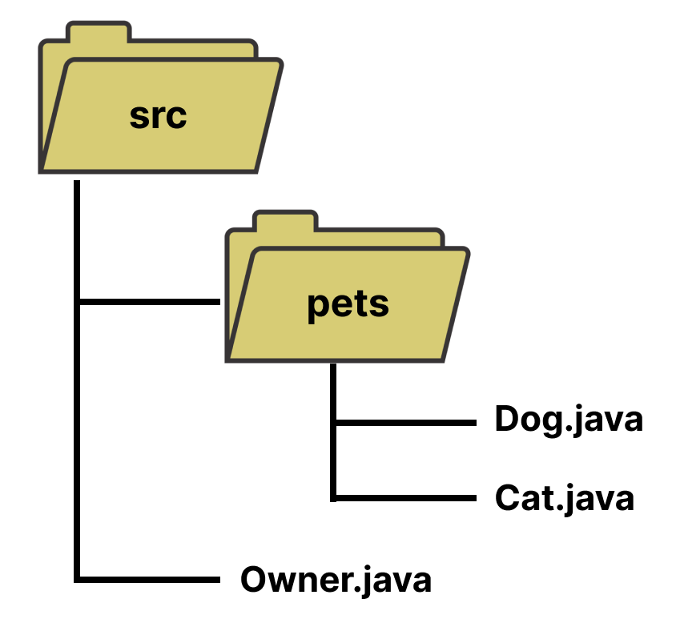

# Lab Assignment 17

In this lab you will practice working with packages.

Unlike previous labs, your class has already been created for you. 

## Let's get started!

For this lab your **main() method** is in the Main class. For this lab you must create the new classes in their packet location.

Now let's begin!

## Packages

In Java you can group files or classes into sub-directories (folders) known as packages. Packaging your classes allows you to organize your classes, especially if you have classes with the same name. 



To create a package, simply create a new folder in your current working directory `src`. Now inside your new folder you can create as many java files as you need. Next you must include the name of the parent folder at the top starting with the keyword `package`. 

For example, let's say we created a new package `pets` and inside we created the classes `Dog.java` and `Cat.java`.

**Code Example for Dog.java:**

```java
// Name of the parent folder.
package pets;

public class Dog {
    // Members go here.
}
```

**Code Example for Cat.java:**

```java
// Name of the paretn folder.
package pets;

public class Cat {
    // Members go here.
}
```

Now, we can use use one or multiple of the classes in our `pets` package by using the `import` keyword to include the class(es) we need. We must use the following structure.

**import [package_name].[class_name]**

You have done this before, think back to when you first used the `Scanner` class from the `java.util` package.

Below is an example on how to import `Dog` and `Cat` classes into the `Owner` class in the `src` directory.

For more practice with packages in Java visit https://www.w3schools.com/java/java_packages.asp and https://www.programiz.com/java-programming/packages-import.

**Code Example for Owner.java:**

```java
// Import the class using [package_name].[class_name]
import pets.Dog;
import pets.Cat;

public class Owner {
    public static void main(String[] args) {
        // You can now use class.
        Dog dog1 = new Dog();
        Cat cat1 = new Cat();
    }
}
```

## Your Program

### Car Dealership Package

For this lab assignment, assume you are working at a car dealership that deals with not just cars, but RVs and trailers. This means we'll need to work with car, RV, and trailer objects. To keep the code organized, define the classes inside a package.

Create classes `Car`, `RV`, and `Trailer` inside the `dealership` folder and **package** them.

The `Car` class should have a **constructor** and the following **public** attributes:
* make (String)
* model (String)
* year (int)

The `RV` class should have a **constructor** and the following **public** attributes:
* make (String)
* year (int)
* size (float)

The `Trailer` class should have a **constructor** and the following **public** attributes:
* make (String)
* size (float)
* weight_capacity (float)

Import the `Car`, `RV`, and `Trailer` classes inside the `Main.java` file and create an object of each.

You can test your solution by running the commands below in your terminal.

```
./build.sh
./test.sh
```

## Submit your assignment

To submit your lab assignment click on the source control icon (3 circles with 2 lines) on your leftside navbar. Next, click on the '+' symbol next to "Changes" to stage your changes. Lastly, add a commit message (ex: "First commit") and click "Commit" then "Push" or "Sync Changes". And you're done!
