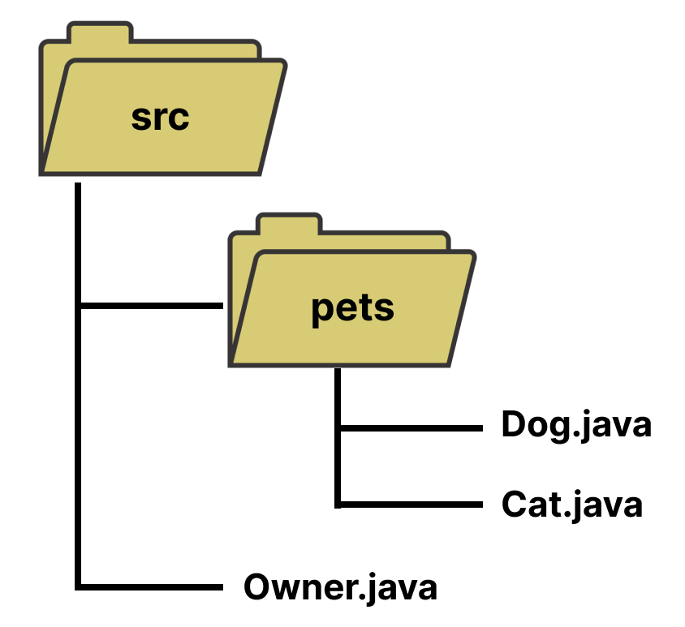

# Lab Assignment 17

In this lab you will practice working with **packages**.

Unlike previous labs, your class has already been created for you. 

## Let's get started!

For this lab your **main() method** is in the Main class. For this lab you must move the new classes to their designated file inside the package.

Now let's begin!

## Packages

In Java you can group files or classes into sub-directories (folders) known as packages. Packaging your classes allows you to organize your classes, especially if you have classes with the same name. 



To create a package, simply create a new folder in your current working directory `src`. Now inside your new folder you can create as many java files as you need. Next you must include the name of the parent folder at the top starting with the keyword `package`. 

For example, let's say we created a new package `pets` and inside we created the classes `Dog.java` and `Cat.java`.

**Code Example for Dog.java:**

```java
// Name of the parent folder.
package pets;

public class Dog {
    // Members go here.
}
```

**Code Example for Cat.java:**

```java
// Name of the paretn folder.
package pets;

public class Cat {
    // Members go here.
}
```

Now, we can use use one or multiple of the classes in our `pets` package by using the `import` keyword to include the class(es) we need. We must use the following structure.

**import [package_name].[class_name]**

You have done this before, think back to when you first used the `Scanner` class from the `java.util` package.

Below is an example on how to import `Dog` and `Cat` classes into the `Owner` class in the `src` directory.

**Code Example for Owner.java:**

```java
// Import the class using [package_name].[class_name]
import pets.Dog;
import pets.Cat;

public class Owner {
    public static void main(String[] args) {
        // You can now use class.
        Dog dog1 = new Dog();
        Cat cat1 = new Cat();
    }
}
```

For more practice with packages in Java visit https://www.w3schools.com/java/java_packages.asp and https://www.programiz.com/java-programming/packages-import.

## Access Modifiers

In Java, by default all classes and their members are **package-private**. This means the class and its members are only accessible within their current directory. When working with packages, it's important to know which access modifier to use.

**Java Access Modifiers**
- Package-Private
- Public
- Private
- Protected

For more practice with access modifiers in Java visit https://www.w3schools.com/java/java_modifiers.asp .

## Your Program

### Car Dealership Package

For this lab assignment, assume you are working with a car dealership program.

The program is using the following classes:

```java
class Engine {
    int cylinders;
    int horsepower;

    Engine(int cyl, int hp) {

        cylinders = cyl;
        horsepower = hp;
    }
}

class Car {
    String make;
    String model;
    int year;
    Engine engine;

    Car(String mk, String md, int yr, int cyl, int hp) {
        make = mk;
        model = md;
        year = yr;
        engine = new Engine(cyl, hp);
    }
}

class Owner {
    String name;
    int phone_number;
    String address;
    Car car;

    Owner(String nm, int pnum, String addr, Car cr) {
        name = nm;
        phone_number = pnum;
        address = addr;
        car = cr;
    }
}
```

Your assignment is to organize the code by moving the classes into their designated .java file.

Use the appropriate **access modifiers** so that the code inside the Main class still works. 

In addition, the `Engine` class should NOT be accessible inside the Main class.

You can test your solution by running the commans below in your terminal.

```
./test.sh
```

<br>

**Grading Criteria:**
| Criteria | Points |
|---|---|
| Moved the **Car** class into Car.java. | 10 |
| Moved the **Owner** class into Owner.java. | 10 |
| Moved the **Engine** class into Engine.java. | 10 |
| The **Owner** and **Car** class are accessible in the Main class. | 20 |
| The **Engine** class is NOT accessible in the Main class. | 20 |
| The code inside Main still works. | 30 |

[How to Submit Assignments to GitHub](https://joselitoguardado.dev/3326/How_to_Submit_Assignments_to_GitHub.pdf)
